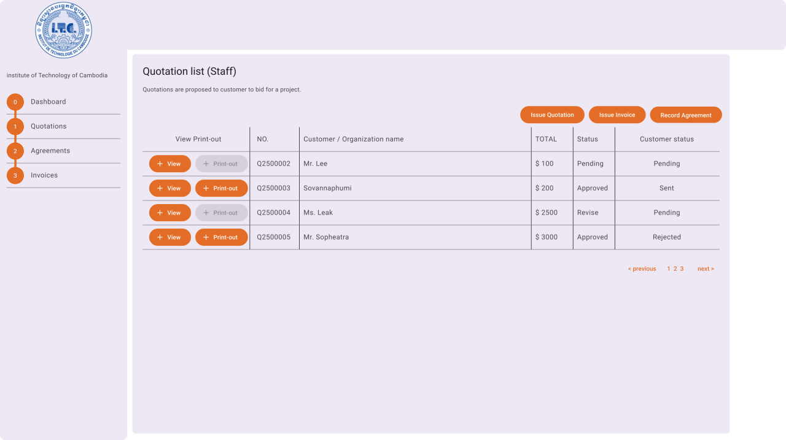
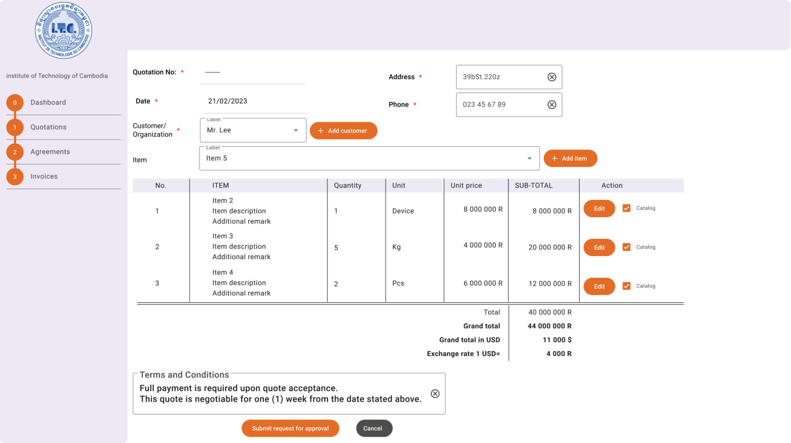
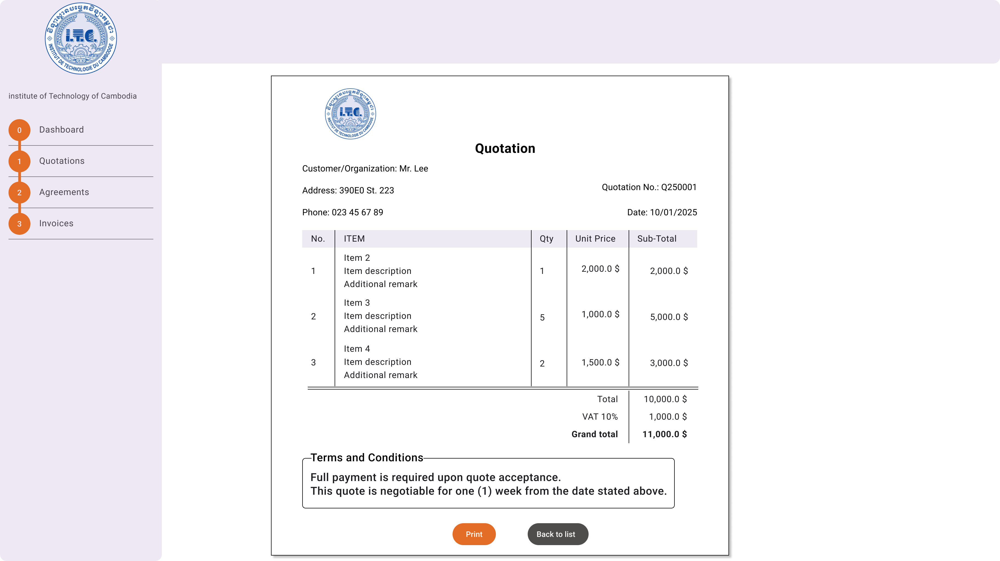
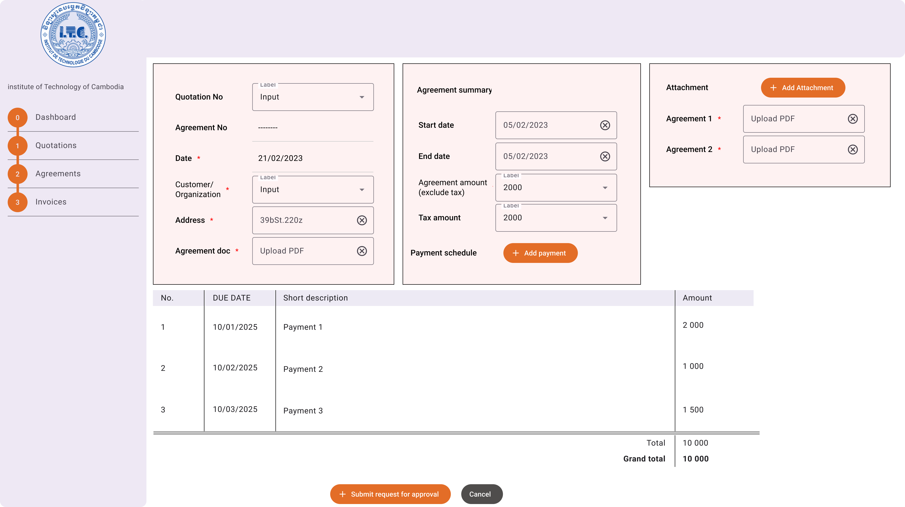
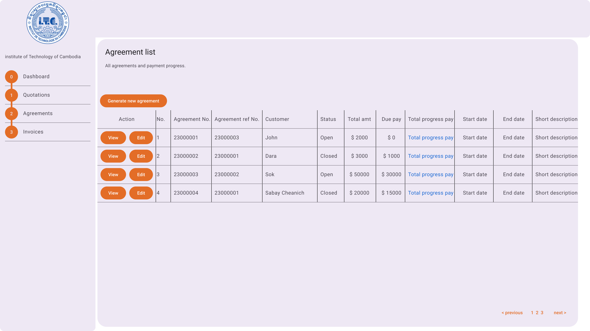
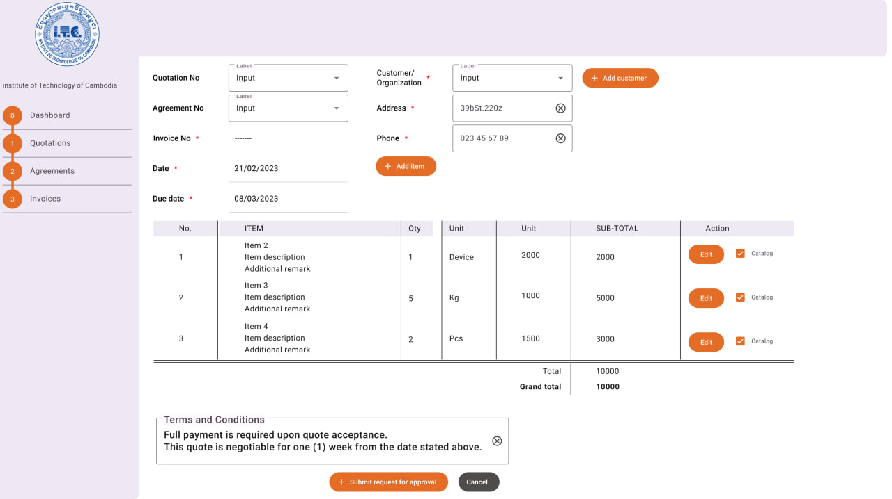

# Invoicing system
Invoicing system is a web application with the following features:
- Manage quotations
- Manage agreements
- Manage invoices

# Landing page


## Manage quotations
Add a new quotation:


View or Print quotation:


Add a new agreement:


## Manage agreements


## Manage invoices


## Installation
First, clone this repository. Then:
- Copy `.env.example` to `.env` and config database:
```ru
DB_CONNECTION=mysql
DB_HOST=127.0.0.1
DB_PORT=3306
DB_DATABASE=invoicing_system
DB_USERNAME=root
DB_PASSWORD=
```
- Run `composer install` (if composer is not available please install `composer`)
- Run `npm i` (if npm is not available please install `Node.js`)
- Run `php artisan key:generate` (to generate new `APP_KEY`)
- Run `php artisan migrate` (to generate tables in the database)

## Run the web app
To serve the web application and auto reload for development, open terminal then run:
```
> php artisan serve
```
Then, open another terminal and run:
```
> npm run dev
```
Keep both running because they are needed as local web server and resources compiler & live-reload.

## Deployment
To deploy the web application on a server or hosting server:
- First run `npm run build` to build css,js, and resources for production
- Copy all files to web hosting server and then point web root folder to public folder
- Export local db to import to server database (if ssh can't be run)

## Test date 24/02/2025
- [ ] Dashboard
- [ ] Quotations
  - [ ] List
  - [ ] Filter
  - [ ] Create
  - [ ] Update
  - [ ] View
  - [ ] Print
  - [ ] Update status from Pending to Aprroved
  - [ ] Issue invoice (link)
  - [ ] Issue agreement (link)
- [ ] Agreements
  - [ ] List
  - [ ] Filter
  - [ ] Create
  - [ ] Update
  - [ ] View
  - [ ] Print
  - [ ] Issue invoice (fully paid)
  - [ ] Close agreement
  - [ ] Cancel agreement
- [ ] Invoices
  - [ ] List
  - [ ] Create
  - [ ] Update
  - [ ] View
  - [ ] Print
  - [ ] Update status from Pending to Aprroved
- [ ] Settings:
  - [x] Customers:
    - [x] List
    - [x] Create
    - [x] Edit
    - [x] Show
    - [x] Delete
  - [ ] Products
    - [ ] List
    - [ ] Create
    - [ ] Edit
    - [ ] Show
    - [ ] Delete
  - [ ] Categories